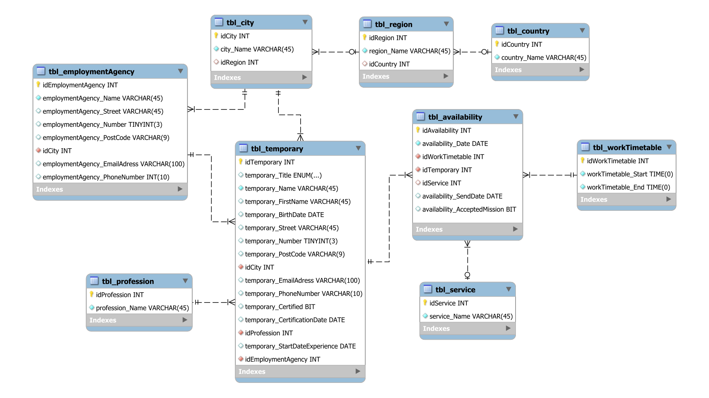

# InterimSearch :: A temporary help request manager

Author: Loan Lassalle
***

## Description

Develop a C# application that automates requests for temps to replace absent staff. The potential client will have direct access, without intermediaries, to available temporary staff, who have the criteria that match the profile sought to carry out the assignment.

## Objectives

* Authenticate the user from his Windows user session.
* Undertake searches for available temporary workers according to the date, time and profession requested by the user.
* Send mission proposals by using pre-formatted emails, from the client to the selected temporary.
* Display graphs representing the number of temporary workers by profession, the number of temporary workers having accepted an assignment by temporary employment agency and the number of temporary workers certified by the potential client.
* Print the working reports of each temp.

## Features

* The authentication interface allows the client to authenticate itself with its Windows user session password.
* The welcome interface presents different criteria to search for available temporary workers according to the need.
* The results interface displays an overview of available temporary workers according to the search.
* From this interface, it is possible to send a mission proposal.
* The interface of the interim profiles can be accessible from the results interface.
* Then from the home interface you can access graphics and proposal emails sent.

## Relational model

